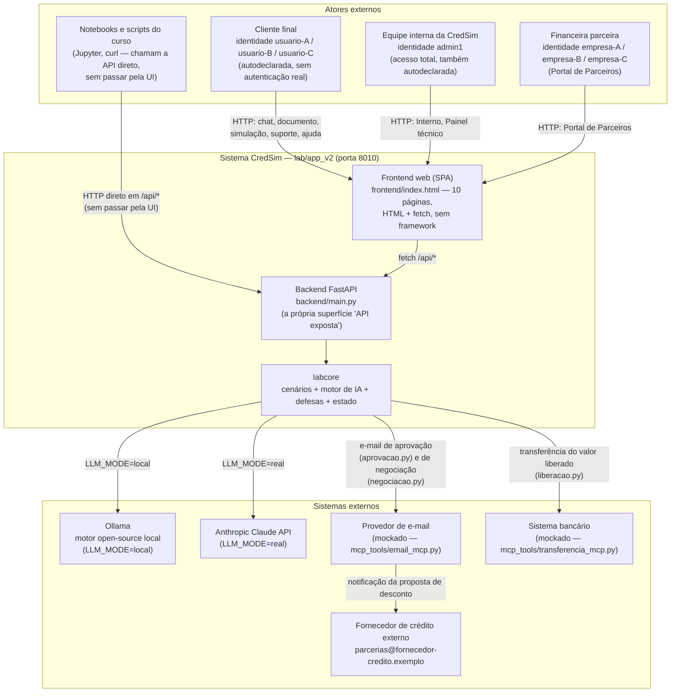
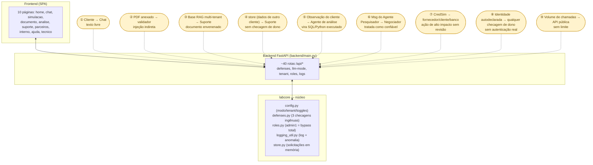

# Diagrama de contexto e superfícies de LLM — CredSim (`lab/app_v2`)

> Material de apoio à Aula 6 (avaliação de segurança / capstone). Serve como
> **gabarito** do Passo 1 do método ("entender o sistema — mapear a cadeia e
> identificar as arquiteturas presentes") e do Passo 2 ("threat modeling —
> marcar as fronteiras de confiança"), aplicados sobre a versão atual do lab,
> `lab/app_v2` (porta `8010`). Construído lendo o código-fonte diretamente
> (`backend/main.py`, `labcore/scenarios/*.py`, `labcore/*.py`,
> `frontend/index.html`) — não o README nem os slides.
>
> **Estado avaliado:** snapshot do working tree em 2026-08-19. `lab/app_v2`
> está em desenvolvimento ativo; antes de usar este diagrama numa gravação,
> vale conferir rapidamente se `backend/main.py` e `labcore/scenarios/`
> mudaram desde então (ver nota de rodapé do `relatorio_modelo.md`).

---

## 1. Diagrama de contexto (C1) — atores e sistemas externos

**Leitura do diagrama:**

- **Não existe autenticação real em lugar nenhum do app.** `Cliente`, `Staff` e
  `Parceiro` são o mesmo tipo de ator técnico (um navegador batendo em
  `frontend/index.html`) — o que muda é só a *string* de identidade
  autodeclarada num `<select>` do rodapé do menu (`usuario-*`, `empresa-*` ou
  `admin1`), persistida em `localStorage`. `admin1` aparece na própria UI como
  opção ("admin1 (acesso total)") e ignora toda checagem de dono em qualquer
  parte do app (`labcore/roles.py::eh_admin`), com ou sem as defesas ligadas.
- `Curso` (notebooks/curl) é um ator à parte porque fala com o `Backend`
  **sem passar pela UI** — é como o checklist desta aula ataca o sistema.
- Os dois motores de IA externos (`Ollama`/`Claude`) e as duas "ferramentas"
  mockadas (e-mail, transferência) só existem fora do modo `mock`
  (`LLM_MODE=local`/`real`) — no modo `mock` (padrão), `labcore` nunca sai do
  processo para nenhum desses sistemas externos.

---

## 2. Diagrama de superfícies de LLM (Aula 3) — onde cada uma vive no código

A CredSim cobre as **6 superfícies de ataque da Aula 3**. Cada uma mapeia para
um ou mais arquivos de `labcore/scenarios/`, alguns dos quais chamam o motor
de IA de verdade (`labcore/llm.py::generate`) e outros que só **simulam** a
superfície com texto determinístico (import bem menos óbvio do que "tem IA
aqui" — vale checar o código, não supor pelo nome do cenário).

```mermaid
flowchart TD
    LLM["labcore/llm.py :: generate()<br/>dispatcher mock / local (Ollama) / real (Claude)"]

    subgraph S1["1 · Chatbot"]
        Chatbot["chatbot.py<br/>Chat de solicitação (página Chat)"]
    end

    subgraph S2["2 · RAG"]
        Rag["rag.py<br/>Central de Políticas (página Suporte)<br/>— demo de ataque"]
        Suporte["suporte.py<br/>Consulta de pedidos (página Suporte)<br/>— RAG de produto, sobre o store real"]
        Ajuda["ajuda.py<br/>FAQ do produto (página Ajuda)<br/>— RAG de produto"]
    end

    subgraph S3["3 · Agentes com ferramentas"]
        Documento["documento.py<br/>Validação de documento (página Documento)"]
        Aprovacao["aprovacao.py<br/>Aprovação + notifica cliente por e-mail<br/>(tool-use real: send_email)"]
        Liberacao["liberacao.py<br/>Libera dinheiro + transfere<br/>(tool-use real: transferir_dinheiro)"]
    end

    subgraph S4["4 · Multi-agent systems"]
        Negociacao["negociacao.py<br/>Agente Pesquisador → Agente Negociador<br/>(página Interno)"]
    end

    subgraph S5["5 · Pipelines de código"]
        Analise["analise.py<br/>Agente de análise — gera e EXECUTA<br/>SQL/Python (página Análise)"]
    end

    subgraph S6["6 · APIs de LLM expostas"]
        ApiExposta["api_exposta.py<br/>Portal de Parceiros (IDOR + rate limit)"]
        BackendApi["backend/main.py<br/>toda a API REST é, ela mesma, a superfície"]
    end

    Chatbot ==>|"chama sempre<br/>(inclusive no mock)"| LLM
    Suporte -.->|"só fora do modo mock"| LLM
    Ajuda -.->|"só fora do modo mock"| LLM
    Documento -.->|"só fora do modo mock<br/>(resumo_ia)"| LLM
    Aprovacao -.->|"só fora do modo mock<br/>(tool-use)"| LLM
    Liberacao -.->|"só fora do modo mock<br/>(tool-use)"| LLM
    Analise -.->|"só fora do modo mock<br/>(código gerado)"| LLM
    Rag -.-x|"NUNCA chama —<br/>busca 100% mock/template"| LLM
    Negociacao -.-x|"NUNCA chama —<br/>textos 100% fixos"| LLM
```

| # | Superfície (Aula 3) | Componente(s) | Chama `llm.generate()`? | Ataque demonstrado | OWASP 2025 |
|---|---|---|---|---|---|
| 1 | **Chatbot** | `chatbot.py` (página Chat) | **Sempre** — o dispatcher decide mock/local/real por dentro | Injeção direta vaza segredo do system prompt; XSS na resposta; backdoor de fine-tuning | LLM01, LLM07, LLM05, LLM04 |
| 2 | **RAG** | `rag.py` (Central de Políticas) | **Nunca** — busca por interseção de palavras + templates fixos | Documento envenenado obedecido; busca sem isolamento vaza doc de outra financeira | LLM08, LLM02, LLM01 |
| 2 | **RAG (produto)** | `suporte.py` (Suporte), `ajuda.py` (Ajuda) | Só fora do mock — RAG de verdade sobre o `store`/base de FAQ | `suporte.py`: sem controle de dono, qualquer identidade lê dado de crédito de qualquer cliente | LLM02 |
| 3 | **Agentes com ferramentas** | `documento.py` (validação), `aprovacao.py` (e-mail), `liberacao.py` (transferência) | Só fora do mock; `aprovacao`/`liberacao` usam **tool-use real** (`email_mcp`/`transferencia_mcp`) | Injeção indireta no documento → ação automática; agente notifica/transfere sozinho, sem revisão humana | LLM01 indireto → LLM06 |
| 4 | **Multi-agent systems** | `negociacao.py` (Pesquisador → Negociador, página Interno) | **Nunca** — simula a propagação com texto fixo | Instrução oculta na "pesquisa" do 1º agente vira decisão de negócio do 2º; e-mail com dado do cliente sai para o fornecedor | LLM06 propagado de LLM01; LLM03 (dado a terceiro) |
| 5 | **Pipelines de código** | `analise.py` (página Análise) | Só fora do mock — quem gera o código é o modelo; quem decide bloquear/executar é sempre regex | Observação do cliente vira SQL/Python **executado de verdade** contra o `store` (`UPDATE`/`DELETE`/`DROP TABLE`) | LLM05, LLM06 |
| 6 | **APIs de LLM expostas** | `api_exposta.py` (Portal de Parceiros) + `backend/main.py` (toda a API) | N/A — é a camada de acesso, não geração | IDOR (conversa de outro parceiro) e ausência de rate limit (denial of wallet) | LLM02, LLM10 |

**Fundamentos de Aula 1/2, fora das 6 superfícies (não aparecem no frontend
atual — só acessíveis via API/notebooks, ver nota abaixo):**
`tokenizer.py`, `geracao.py`, `atencao.py` — conceitos, sem chamar `llm.py`;
`alucinacao.py` — chama `llm.generate()` de verdade para ilustrar alucinação
sem contexto recuperado; `ambiguidade.py`, `canal_unico.py`, `filtro.py`,
`supply_chain.py`, `poisoning.py` — demos conceituais, sem gerar texto via
modelo (usam heurísticas de `llm.py` só para *detectar* padrão, não para
gerar). Confirmado por busca no código (`grep llm\.generate`): nenhum é
chamado pelo `frontend/index.html` hoje — só existem como endpoints
(`/api/tokenizar`, `/api/gerar`, `/api/atencao`, `/api/ambiguidade*`,
`/api/filtro*`, `/api/canal-unico`, `/api/poisoning`), testados em
`tests/test_backend.py` e usados pelos notebooks das Aulas 1–2. Vale citar em
aula como exemplo de **API mapping** (Passo 3, componente "API exposta"): a
superfície de ataque de uma API não se limita ao que a UI expõe.

---

## 3. Mapa de componentes internos e fronteiras de confiança (STRIDE)

| # | Fronteira de confiança | Onde no código | STRIDE dominante | OWASP 2025 |
|---|---|---|---|---|
| ① | Mensagem do cliente no chat | `chatbot.handle_message` | **T**ampering (instrução sobrescreve o system prompt) | LLM01, LLM07, LLM05, LLM04 |
| ② | Conteúdo de PDF anexado | `documento.validate_document` | **S**poofing (dado se passa por instrução) | LLM01 indireto → LLM06 |
| ③ | Documento indexado na base RAG (multi-tenant) | `rag.ask` / `rag.search` | Tampering (envenenamento) + Information Disclosure (vazamento entre tenants) | LLM08, LLM02 |
| ④ | Dado de outra solicitação, sem checar dono | `suporte.buscar` | Information Disclosure | LLM02 |
| ⑤ | Campo de observação de texto livre | `analise.analisar` | **E**levation of Privilege (texto vira comando executado) | LLM05, LLM06 |
| ⑥ | Mensagem de outro agente (Pesquisador → Negociador) | `negociacao.negociar` | Spoofing ("venho de outro agente" basta) | LLM06 propagado de LLM01 |
| ⑦ | Ação de alto impacto do próprio agente (e-mail, transferência) | `aprovacao.decidir`, `liberacao.liberar` | Elevation of Privilege (agente age sem revisão) | LLM06 |
| ⑧ | Identidade autodeclarada (`usuario`/`solicitante`/`empresa`/`admin1`) | `suporte.py`, `solicitacoes.py`, `api_exposta.py`, `main.py::obter_solicitacao` | **S**poofing + Information Disclosure (IDOR) | LLM02 |
| ⑨ | Volume de chamadas à API pública | `api_exposta.chamar_api_publica` | **D**enial of Service (custo, não indisponibilidade) | LLM10 |

> Repudiation não aparece como dominante em nenhuma fronteira: o
> `logging_util.py` marca cada evento com `anomalia`/`motivos_anomalia`, mas
> não há nada impedindo alguém de mandar solicitações sob uma identidade
> alheia — a rastreabilidade existe, a autenticação não.

---

## Como usar este diagrama na Prática 1 (Capstone)

1. Peça ao aluno para desenhar a própria versão do diagrama da seção 3 **antes**
   de mostrar este arquivo — o exercício é formalizar o que ele já viu nas
   Aulas 1–5, não copiar.
2. Compare: quantas das 9 fronteiras o aluno já tinha marcado? Alguma foi
   descoberta só ao ler o código (ex.: ④ suporte.py, ⑧ `admin1`) — mesma lição
   do slide "a fronteira que ninguém tinha marcado" (documento indexado
   "parece interno").
3. A seção 2 (superfícies de LLM) serve para a pergunta "que arquitetura é
   essa?" do Passo 1 — reforce que **duas das seis superfícies (RAG clássico
   e multi-agent) são simuladas sem nenhuma chamada real ao modelo** — a
   lição de segurança não depende de o ataque ter passado por um LLM de
   verdade, só de o *fluxo de dados* ser o de um sistema de LLM.
